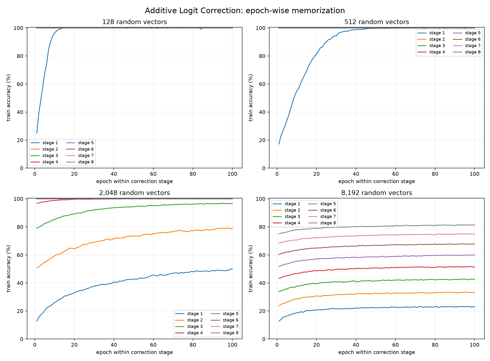

# Research Note: Additive Logit Correction on Random-Label Memorization

Date: 2026-08-18 (UTC)

## Objective

This experiment tests the staged additive logit correction scheme described in
`Additive_Logit_Correction.md` on a controlled memorization task. The task uses
random 64-dimensional Gaussian vectors and random labels from ten classes. It
is deliberately not a generalization benchmark: the purpose is to observe how
successive correction networks reduce the residual training error.

At stage `t`, the model is updated according to

`z_t(x) = stopgrad(z_{t-1}(x)) + f_t(x)`,

where `f_t` is a newly initialized network. Only the new correction network is
optimized at that stage; all earlier correction networks are frozen. The final
prediction is the sum of all stage logits.

## Setup

- Input: random `N x 64` Gaussian vectors
- Labels: independent random integers in `[0, 10)`
- Correction network: `64 -> 16 -> 16 -> 10`, ReLU activations
- Optimizer: AdamW, learning rate `1e-2`, zero weight decay
- Three random trials for each vector count
- Eight correction stages
- 100-epoch budget per stage, with the same vector-scaled step budget used by
  the random-vector memorization experiment
- Stage metrics are measured on the complete memorization set after every epoch
- There are no comparison conditions in this experiment

One correction network has 1,482 parameters. Eight stages therefore contain
11,856 parameters in total, although only one stage is trainable at a time.

## Results

The table reports the mean training accuracy across three trials at selected
stages.

| Vectors | Stage 1 | Stage 2 | Stage 4 | Stage 8 |
| ---: | ---: | ---: | ---: | ---: |
| 128 | 100.00% | 100.00% | 100.00% | 100.00% |
| 512 | 99.93% | 100.00% | 100.00% | 100.00% |
| 2,048 | 49.90% | 78.66% | 99.93% | **100.00%** |
| 8,192 | 23.01% | 33.24% | 51.25% | **81.45%** |

For 2,048 vectors, the additive model reached complete memorization by stage 8.
For 8,192 vectors, accuracy increased monotonically at the stage level from
approximately 23% to 81%, while mean NLL decreased from 2.056 at stage 1 to
0.628 at stage 8.

The epoch-wise curves show that each new stage starts from the previous stage's
solution and learns an additional residual improvement. The effect is most
visible for 2,048 and 8,192 vectors, where a single small network is not enough
to memorize the full random-label dataset under the fixed budget.

## Interpretation

These results are consistent with the intended residual-correction behavior:
the new network does not need to recreate the entire classifier, and can spend
its capacity on reducing the remaining errors in logit space. The experiment
also shows that additive correction is not equivalent to merely training one
larger network: capacity is introduced sequentially, with previous functions
held fixed.

The result should not be interpreted as a useful-data generalization claim.
Random-label memorization is a probe of optimization and cumulative fitting
capacity. It does not establish an advantage on natural data, nor does it
measure communication cost or wall-clock efficiency in a distributed system.

## Artifacts

- `additive_logit_correction_memorization.py`: reproducible experiment script
- `additive-logit-correction-results/records.json`: stage-level results and all
  epoch records
- `additive-logit-correction-results/records.csv`: stage-level result table
- `additive-logit-correction-results/epoch_records.csv`: epoch-level metrics
- `additive-logit-correction-results/epoch_curves.png`: generated figure
